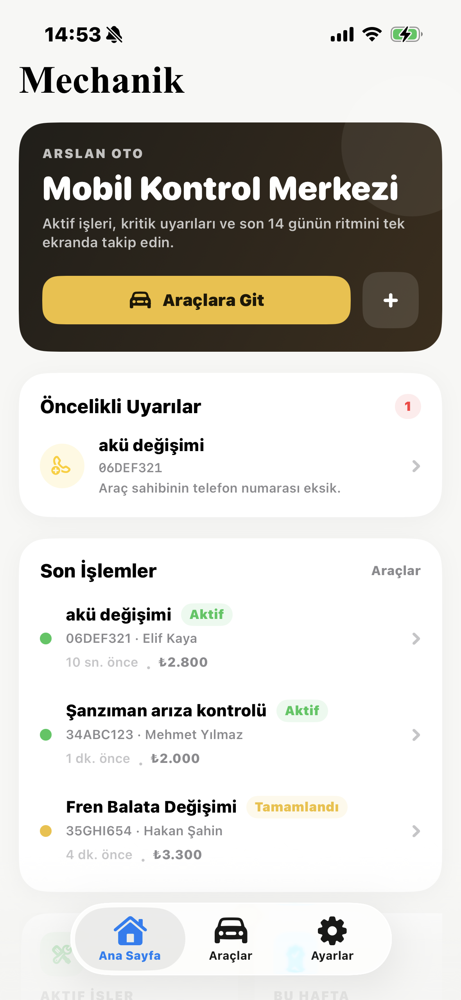
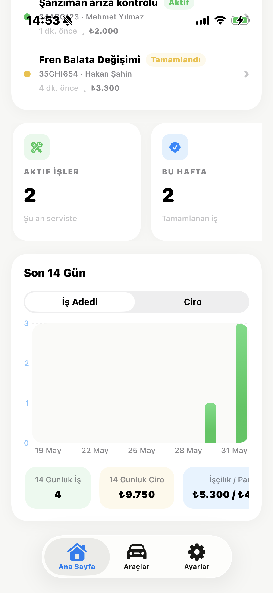
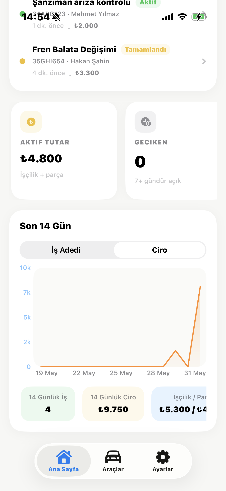
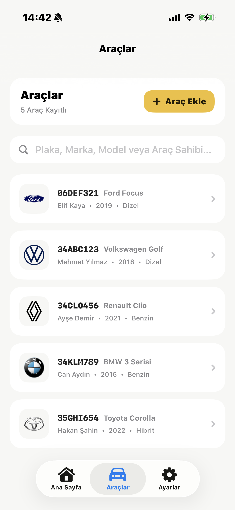
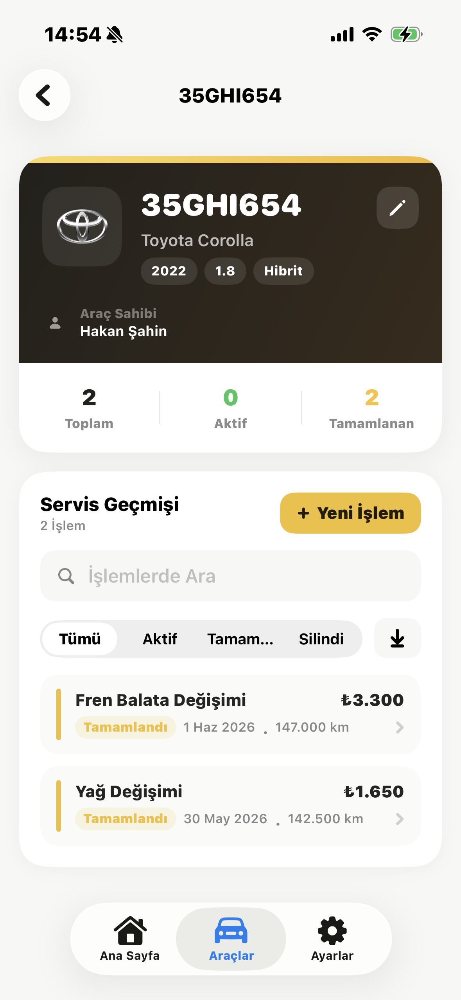
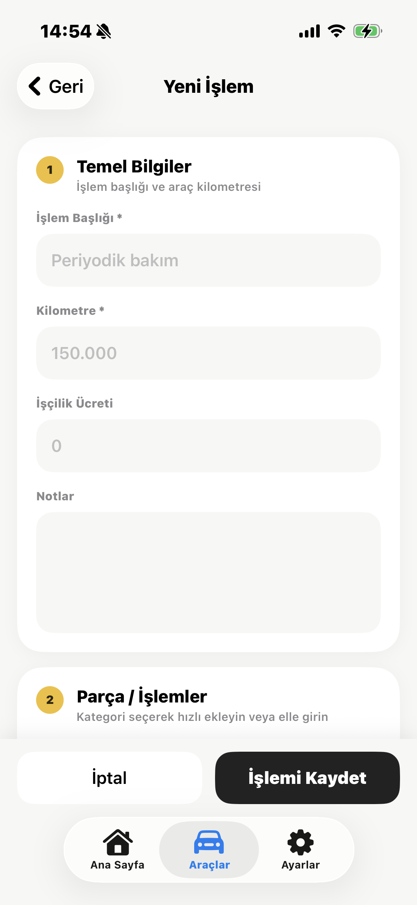
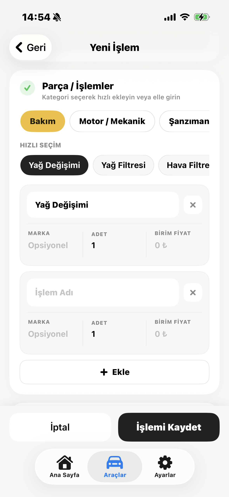
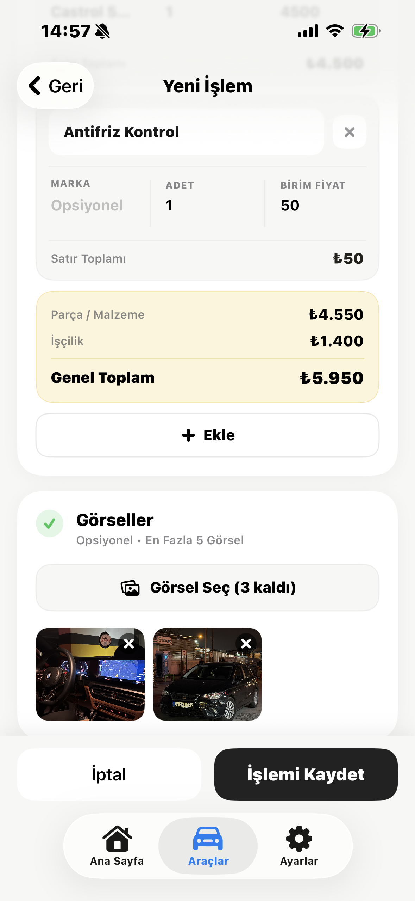
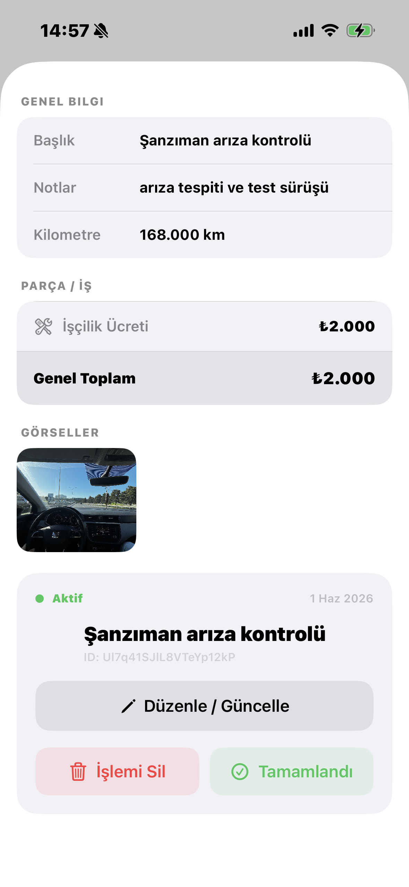
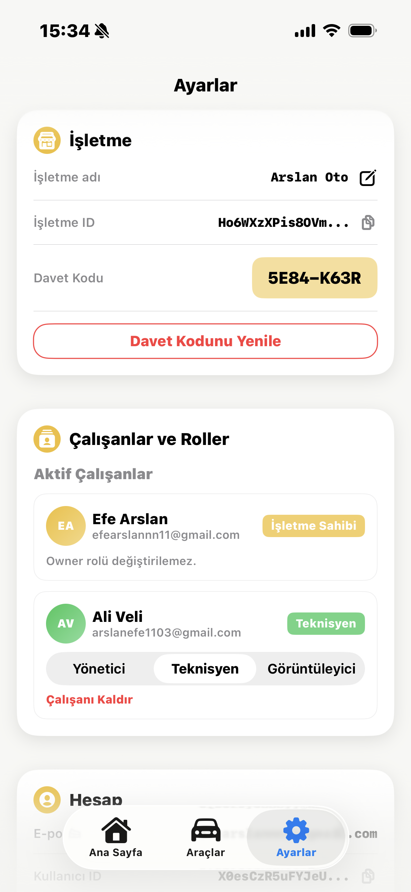

# 🚗 Vehicle Service Management System (iOS)

Native iOS client for the **Mechanik** automotive workshop platform. Manage vehicles, service jobs, costs, and workshop performance on iPhone and iPad, backed by the same Firebase project as the [web panel](https://github.com/efarslan/mechanik-panel).

---

## Overview

This app digitizes day-to-day workshop operations on mobile: vehicles, service jobs, costing, and a home dashboard with KPIs and trends.

The goal matches the web product — structured, traceable service history instead of scattered notes — with a SwiftUI experience tuned for iOS.

---

## Features

### Business Management

- Create and manage a business account
- Join businesses via invitation code
- Role-based access (Owner / Employee)
- Team and business settings

### Vehicle Management

- Register vehicles with customer information
- Structured vehicle history and detail views
- Service records per vehicle with filtering

### Service Operations

- Create detailed service jobs (maintenance, repair, diagnostics)
- Predefined and custom service categories
- Mileage-based tracking
- Attach images for documentation
- Full lifecycle tracking (Active → Completed)

### Cost Management

- Parts, quantities, and unit prices per job
- Automatic total cost calculation
- Separate labor and parts tracking
- Transparent per-job cost breakdown

### Home Dashboard

- Active job monitoring and alerts
- Recent jobs with quick access to details
- Revenue and job KPIs
- Trend charts (jobs / revenue)

---

## Problem It Solves

- No structured service history on the shop floor
- Hard to look up past maintenance while with a customer or at a vehicle
- Opaque job-level costing without a single source of truth
- No mobile access to the same workshop data as the web panel

---

## Tech Stack

- **Swift** & **SwiftUI**
- **Swift Charts** (dashboard analytics)
- **Firebase** (Auth, Firestore, Storage) via Swift Package Manager
- **MVVM**-style feature modules (`Features/`, `Services/`, `ViewModels/`)

---

## Related Project

| Platform | Repository |
|----------|------------|
| Web (Next.js) | [mechanik-panel](https://github.com/efarslan/mechanik-panel) |
| iOS (this repo) | [mechanik-ios](https://github.com/efarslan/mechanik-ios) |

Business analysis and QA documentation live in the web repository under `docs/ba/` and `docs/qa/`.

---

## Documentation

Structured BA and QA docs ship with the web project:

**Business Analysis**
- System overview, personas, and epics → `docs/ba/`
- Feature specs (Vehicle, Service, Reporting) → `docs/ba/features/`
- Process flow diagrams → `docs/ba/diagrams/`

**Quality Assurance**
- Feature-level test cases → `docs/qa/`
- Cross-module integration tests → `docs/qa/cross-module-tests.md`
- System-level scenarios → `docs/qa/system_testcases.md`

> Documentation reflects a real-world BA + QA workflow alongside development.

---

## Getting Started

### Prerequisites

- macOS with **Xcode** (version that supports the project's iOS deployment target)
- An Apple Developer account (for device testing; Simulator is enough for local dev)
- A Firebase project shared with the web app (Auth, Firestore, Storage enabled)

### Setup

1. Clone the repository:

   ```bash
   git clone https://github.com/efarslan/mechanik-ios.git
   cd mechanik-ios
   ```

2. Open the Xcode project:

   ```bash
   open Mechanik/Mechanik.xcodeproj
   ```

3. **Firebase** — Ensure `Mechanik/Mechanik/GoogleService-Info.plist` matches your Firebase iOS app (download from the Firebase console if needed). Do not commit production secrets to a public fork without reviewing what is safe to expose.

4. In Xcode, select the **Mechanik** scheme and a simulator or connected device, then **Run** (⌘R). Swift Package Manager will resolve **firebase-ios-sdk** on first build.

### First Launch Flow

1. Sign in or register (Firebase Auth)
2. Verify email when prompted
3. Create a business or join with an invitation code
4. Use **Home**, **Vehicles**, and **Settings** tabs to work with jobs and the team

---

## Screenshots

### Authentication & Onboarding

<p align="center">
  
  
</p>

### Home & Analytics

<p align="center">
  
  
  
</p>

### Vehicles

<p align="center">
  
  
</p>

### Service Jobs

<p align="center">
  
  
  
</p>

<p align="center">
  
</p>

### Team

<p align="center">
  
</p>

---

## AI Usage

AI tools were used as a development assistant for productivity and debugging support.

Architecture decisions, system design, and implementation logic were fully controlled and directed by the developer.

---

## Status

This project is under **active development**. New features and improvements are added continuously and kept in sync with the web platform where it makes sense.

---

## Feedback

Feedback, suggestions, and improvements are welcome — open an issue or reach out via the repository.